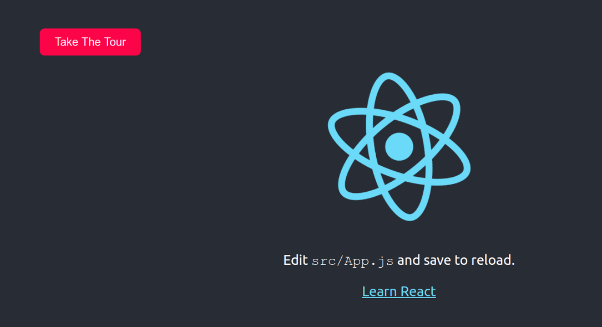
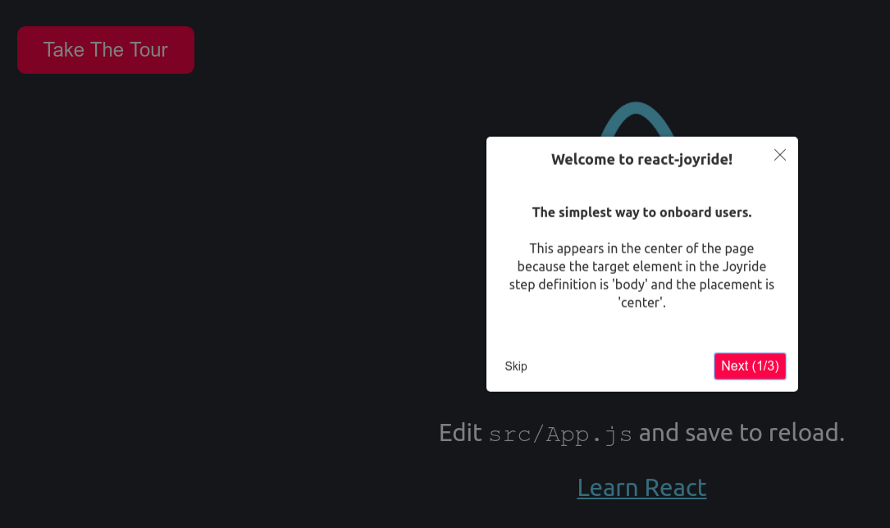

# React Joyride

[](https://www.npmjs.com/package/react-joyride) [](https://travis-ci.org/gilbarbara/react-joyride) [](https://codeclimate.com/github/gilbarbara/react-joyride/maintainability) [](https://codeclimate.com/github/gilbarbara/react-joyride/test_coverage)

[](https://react-joyride.com/)

#### Create awesome tours for your app!

Showcase your app to new users or explain functionality of new features.

It uses [react-floater](https://github.com/gilbarbara/react-floater) for positioning and styling.  
And you can use your own components too!

**View the demo [here](https://react-joyride.com/)**

**Read the [docs](https://docs.react-joyride.com/)**

Chat about it in our [Spectrum community](https://spectrum.chat/react-joyride)


## Getting Started


### 1. Create a sample app:

```bash
npx create-react-app joyride-sample
cd joyride-sample
```

### 2. Setup

```bash
npm i react-joyride
```

### 3. In ```./src```, create a file called ```OnboardingSteps.js```:

```jsx
import React, { useState } from 'react';
import ReactJoyride from 'react-joyride';

const OnboardingSteps = () => {
  const [joyride, setJoyride] = useState({
    run: false,
    steps: [
      {
        title: "Welcome to react-joyride!",
        target: "body",
        placement: "center",
        content: <div><h4>The simplest way to onboard users.</h4><p>This appears in the center of the page because the target element in the Joyride step definition is 'body' and the placement is 'center'.</p></div>,
        disableBeacon: true,
      },
      {
        title: "Joyride Is A Great Way To Point At Things",
        target: ".App-logo",
        content: "Look, the React Spinning Atom logo. It's identified by its className, ('App-logo') in the Joyride step definition target.",
      },
      {
        title: "Finally ...",
        target: ".App-link",
        content: "Take action!",
      },
    ]
  });

  return (<React.Fragment>
    <div style={{ marginLeft: "10%", marginRight: "auto" }}>
      <button
        onClick={() => { setJoyride({ ...joyride, run: !joyride.run }); }}
        style={{ backgroundColor: "#ff0044", color: "white", border: "none", fontSize: "24px", padding: "15px 32px", cursor: "pointer", borderRadius: "10px" }}>Take The Tour</button>
    </div>
    <ReactJoyride
      steps={joyride.steps}
      run={joyride.run}
      continuous
      showProgress
      showSkipButton />
  </React.Fragment>);
};

export default OnboardingSteps
```

### 4. In ```./src/App.js```, import the Onboarding component and display it by adding the following two lines:

```jsx
import React from 'react';
import logo from './logo.svg';
import OnboardingSteps from './OnboardingSteps' // <------- ADD THIS LINE ...
import './App.css';

function App() {
  return (
    <div className="App">
      <header className="App-header">
	        <OnboardingSteps />                       { /* <------- ... AND THIS LINE. */ }
        
        <p>
          Edit <code>src/App.js</code> and save to reload.
        </p>
        <a
          className="App-link"
          href="https://reactjs.org"
          target="_blank"
          rel="noopener noreferrer"
        >
          Learn React
        </a>
      </header>
    </div>
  );
}

export default App;

```

### 5. Start the app with ```npm start```:




Start the tour:



## Development

Setting up a local development environment is easy!

Clone (or fork) this repo on your machine, navigate to its location in the terminal and run:

```bash
npm install
npm link # link your local repo to your global packages
npm run watch # build the files and watch for changes
```

Now clone https://github.com/gilbarbara/react-joyride-demo and run:

```bash
npm install
npm link react-joyride # just link your local copy into this project's node_modules
npm start
```

**Start coding!** 🎉
