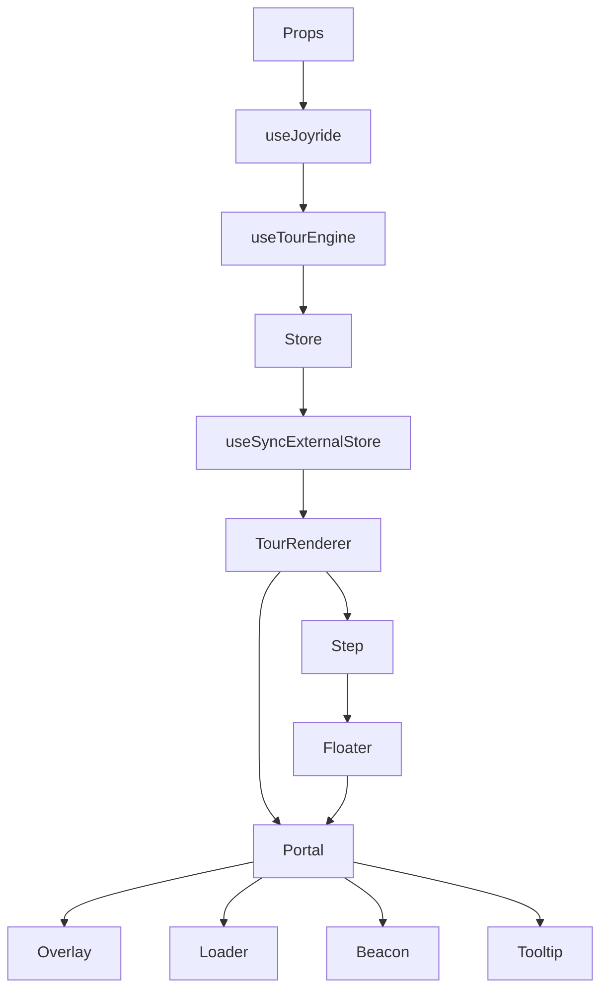
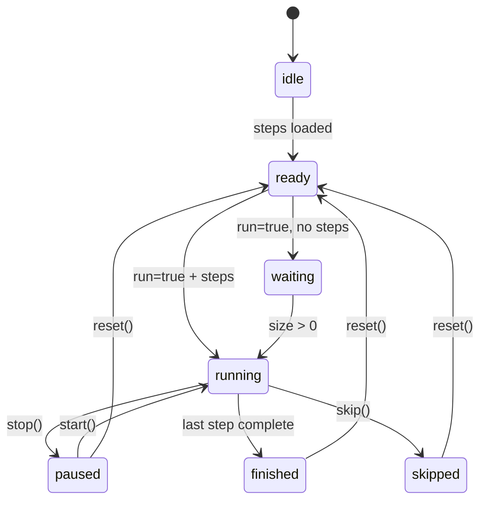
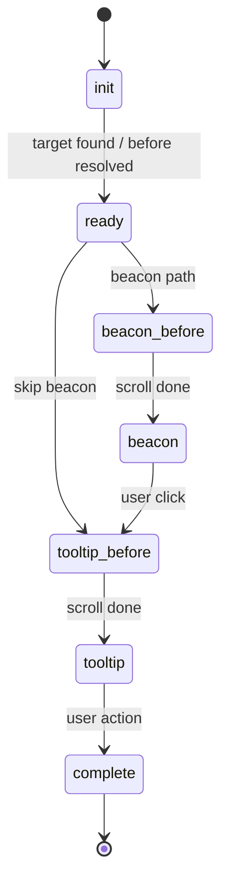
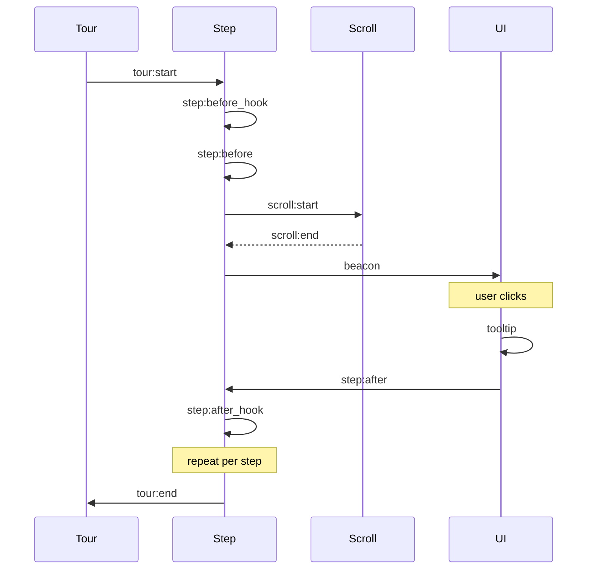
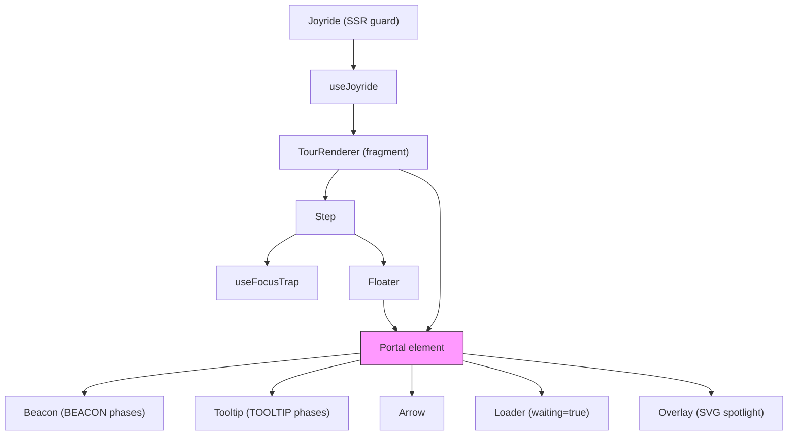

# React Joyride Architecture

## Data Flow



Two public APIs:
- `<Joyride>` component — SSR-safe wrapper that calls `useJoyride` internally
- `useJoyride(props)` hook — returns `{ controls, failures, on, state, step, Tour }`

## State Machine

Two dimensions drive the tour:

### Tour Status (overall)



- `idle`: No steps loaded
- `ready`: Steps loaded, waiting for `run=true`
- `waiting`: `run=true` but steps loading async (transitions to RUNNING when size > 0)
- `running`: Tour active
- `paused`: Stopped mid-tour via `stop()` (can resume with `start()`)
- `finished`: Tour completed normally
- `skipped`: Tour ended via `skip()`

### Step Lifecycle (per step)



- `init`: Step starting, target check pending, `before` hook runs here
- `ready`: Target found and visible, preparing render
- `beacon_before`: Beacon positioned, waiting for scroll to complete
- `beacon`: Showing pulsing beacon
- `tooltip_before`: Tooltip positioned, waiting for scroll to complete
- `tooltip`: Showing tooltip content
- `complete`: Step done, transitioning to next

Beacon is skipped (goes straight to `tooltip_before`) when:
- `skipBeacon = true`
- `step.placement = 'center'`
- `continuous` mode AND action is NEXT or PREV

The `*_before` phases exist to hold rendering while scroll animation completes. The scroll effect watches for `positioned=true` during these phases, scrolls, then sets `scrolling=false`, which triggers the transition to the final `beacon`/`tooltip` phase.

### Complete State Transition Sequence

A full multi-step tour from mount to finish:

```
mount: run=true, steps=[...]
  → start() → status:running, lifecycle:init
  → tour:start event
  → [before hook runs if defined → step:before_hook event → waiting:true → loader shown]
  → lifecycle: init→ready (target check / before hook resolved)
  → step:before event (action: lastAction ?? update)
  → lifecycle: ready → *_before (beacon_before or tooltip_before)
  → scrolling:true, positioned via Floating UI → scroll animation
  → scroll:start event
  → scroll:end event → scrolling:false
  → lifecycle: *_before → beacon or tooltip
  → beacon event
  → User clicks beacon → lifecycle: beacon → tooltip_before → tooltip
  → tooltip event
  → Focus trap activated
  → User clicks "Next" → controls.next() → lifecycle:complete, index+1
  → step:after event (reports previous index)
  → [after hook runs if defined → step:after_hook event]
  → lifecycle: complete → init (auto-advance in uncontrolled; controlled waits for parent to update stepIndex)
  → ... repeats for each step ...
  → Last step: index >= size → status:finished
  → tour:end event (reports last step)
  → controls.reset() → status:ready, index:0
```

## Controlled vs Uncontrolled

**Uncontrolled** (default): Store manages index internally. `next()`/`prev()`/`go()`/`reset()` work. Auto-advances past missing targets. Supports `initialStepIndex` for starting at a specific step.

**Controlled** (with `stepIndex` prop): Tour pauses at each step's COMPLETE lifecycle phase instead of auto-advancing. Parent manages the step index via `onEvent` callbacks. `go()` and `reset()` are disabled in controlled mode.

## Store (`src/modules/store.ts`)

Class managing immutable state via plain objects. Snapshots are `Object.freeze()`d. Created once per component instance via `useRef`. Subscriptions drive React re-renders via `useSyncExternalStore`.

### State Shape

```typescript
{
  action: Actions        // What triggered the change
  controlled: boolean    // true if controlled prop is set
  index: number          // Current step index
  lifecycle: Lifecycle   // Step lifecycle phase
  origin: Origin | null  // What triggered the action (button_close, button_skip, button_primary, keyboard, overlay)
  positioned: boolean    // Whether floating element has been positioned (internal only)
  scrolling: boolean     // Whether scroll animation is in progress
  size: number           // Total steps count
  status: Status         // Tour status
  waiting: boolean       // Waiting for before hook or target polling
}
```

`positioned` is internal — stripped from public `State` type via `omit(snapshot, 'positioned')`.

### Store Methods

| Method | Description |
|--------|-------------|
| `updateState(patch, forceIndex?)` | Merge patch, freeze snapshot, notify listeners. Controlled mode ignores `index` unless `forceIndex=true` |
| `subscribe(listener)` | Returns unsubscribe function. Used by `useSyncExternalStore` |
| `getSnapshot()` / `getServerSnapshot()` | Frozen state for `useSyncExternalStore` |
| `getState()` | Public state (without `positioned`) |
| `getEventState()` | Same as `getState()` — for event payloads |
| `setPositionData(name, data)` | Stores beacon/tooltip `PositionData`. Sets `positioned=true` during `*_before` phases |
| `getPositionData(name)` | Returns cached position data |
| `cleanupPositionData()` | Clears both position caches (called on step init) |
| `setSteps(steps)` | Updates internal steps array and size |

`applyTransitions()` auto-promotes `WAITING → RUNNING` when `size > 0`.

## Event System

Single `onEvent` prop receives `EventData` and `Controls`:

```typescript
type EventHandler = (data: EventData, controls: Controls) => void;

type EventData = TourData & {
  error: Error | null;      // Only for ERROR events
  scroll: ScrollData | null; // Only for SCROLL_START/SCROLL_END
  scrolling: boolean;
  type: Events;
  waiting: boolean;
}
```

The `controls` parameter gives event handlers direct access to tour control methods (next, prev, start, stop, etc.).



All events: `tour:start`, `step:before_hook`, `step:before`, `scroll:start`, `scroll:end`, `beacon`, `tooltip`, `step:after`, `step:after_hook`, `tour:end`, `tour:status` (on STOP/RESET), `error:target_not_found`, `error`

## Controls (`src/hooks/useControls.ts`)

Extracted hook providing all tour control methods. Created once via `useMemo`, returned to consumers.

| Method | Effect |
|--------|--------|
| `close(origin?)` | RUNNING only. Sets `action:CLOSE, index+1, lifecycle:COMPLETE` |
| `go(nextIndex)` | RUNNING + uncontrolled only. Sets `action:GO, index=nextIndex, lifecycle:COMPLETE`. FINISHED if index >= size |
| `info()` | Returns current public state |
| `next()` | RUNNING only. Sets `action:NEXT, index+1 (clamped to size), lifecycle:COMPLETE` |
| `open()` | RUNNING only. Sets `lifecycle:TOOLTIP_BEFORE` to force-open tooltip |
| `prev()` | RUNNING only. Sets `action:PREV, index-1 (clamped to 0), lifecycle:COMPLETE` |
| `reset(restart?)` | Uncontrolled only. Sets `index:0, lifecycle:INIT, status:READY (or RUNNING if restart)` |
| `skip(origin?)` | RUNNING only. Sets `action:SKIP, lifecycle:COMPLETE, status:SKIPPED` |
| `start(nextIndex?)` | Sets `action:START, lifecycle:INIT, status:RUNNING (or WAITING if no steps)`. Uses `forceIndex=true` |
| `stop(advance?)` | Not if FINISHED/SKIPPED. Sets `action:STOP, lifecycle:COMPLETE, status:PAUSED`. `index+1` if advance |

All methods also reset `positioned:false, scrolling:false, waiting:false`.

## Orchestration Hooks

### useJoyride (`src/hooks/useJoyride.tsx`)

Public hook. Calls `useTourEngine`, wraps state (strips `positioned`), creates `TourRenderer` element, returns `{ controls, failures, on, state, step, Tour }`.

### useTourEngine (`src/hooks/useTourEngine.ts`)

Core orchestrator. Creates store once via `useRef(createStore(mergedProps))`, subscribes via `useSyncExternalStore`. Merges props with defaults via `useMemoDeepCompare`.

On mount: if `run=true` and steps exist and valid, calls `controls.start()`.

Delegates to five sub-hooks:
- `useControls` — tour control methods
- `useEventEmitter` — centralized event emission
- `usePropSync` — external prop change handling
- `useLifecycleEffect` — state machine progression
- `useScrollEffect` — scroll-to-target

### useEventEmitter (`src/hooks/useEventEmitter.ts`)

Centralizes all `onEvent` calls into a single `emitEvent(type, step, overrides?)` function. Uses refs for `onEvent` and `controls` to keep callback identity stable. Composes event data from `store.getEventState()` + defaults (`error: null`, `scroll: null`) + step + type + overrides. Passes `controls` as second argument to `onEvent`.

Used by `usePropSync`, `useLifecycleEffect`, and `useScrollEffect` instead of calling `onEvent` directly.

### usePropSync (`src/hooks/usePropSync.ts`)

Handles external prop changes:

- **Steps change**: Validates steps, calls `store.setSteps(steps)`. Fires `error` event if invalid.
- **Run toggle**: `run=true` → `controls.start()`, `run=false` → `controls.stop()`

### useLifecycleEffect (`src/hooks/useLifecycleEffect.ts`)

Five separate effects drive the state machine:

**Effect 1: Action tracking** (`deps: [action]`)
Tracks NEXT/PREV/SKIP/CLOSE actions in `lastAction` ref for enriching callbacks.

**Effect 2: Target resolution** (`deps: [index, lifecycle, status, store]`)
When RUNNING + step exists + lifecycle is INIT:
1. Cleans up position data
2. If step has `before` hook: sets `waiting=true`, fires `STEP_BEFORE_HOOK`, runs the async hook with AbortController + timeout. On resolve/reject/timeout → sets `lifecycle:READY, waiting:false`
3. If no `before` hook: checks target visibility
   - Target visible → `lifecycle:READY`
   - `targetWaitTimeout=0` → `lifecycle:READY` (proceed without target)
   - Otherwise → polls at 100ms intervals, sets `waiting=true`. On timeout → `lifecycle:READY`

**Effect 3: Step presentation** (`deps: [lifecycle, store]`)
When lifecycle reaches READY:
- Target visible + from INIT → fires `STEP_BEFORE` event
- Target visible → determines final lifecycle (BEACON or TOOLTIP via `hideBeacon()`), checks if scroll needed, sets `lifecycle:*_BEFORE, scrolling:willScroll`
- Target not visible (RUNNING, not INIT/COMPLETE) → fires `TARGET_NOT_FOUND`, auto-advances in uncontrolled mode

**Effect 4: Transitions + callbacks** (`deps: [lifecycle, positioned, scrolling, store]`)
- `*_BEFORE` phase + `scrolling=false` → transitions to final BEACON/TOOLTIP
- BEACON lifecycle → fires `beacon` event
- TOOLTIP lifecycle → fires `tooltip` event
- COMPLETE lifecycle (from TOOLTIP) → fires `step:after` event, runs `after` hook (fire-and-forget), fires `step:after_hook` event

**Effect 5: Tour flow** (`deps: [action, index, lifecycle, size, status, store]`)
- No step + lifecycle INIT → sets FINISHED
- Uncontrolled + COMPLETE + index < size → auto-advances to INIT (controlled mode pauses here, waiting for parent to update `stepIndex`)
- COMPLETE + index >= size → sets FINISHED
- Status → FINISHED/SKIPPED → fires `tour:end`, calls `controls.reset()`, clears lastAction
- Status → RUNNING (from IDLE/READY/PAUSED) → fires `tour:start`
- Action → STOP → fires `tour:status`, clears lastAction
- Action → RESET → fires `tour:status`, clears lastAction

### useScrollEffect (`src/hooks/useScrollEffect.ts`)

Scrolls to target when lifecycle reaches `*_before` phases and `positioned=true` and `scrolling=true`:

- Custom scroll parent: first scrolls page to bring parent into view, then scrolls within parent
- `adjustForPlacement()`: accounts for placement (top, left, right) to avoid tooltip being off-screen after scroll
- Fires `scroll:start` and `scroll:end` events with `ScrollData` (initial, target, element, duration)
- Sets `scrolling:false` on completion, triggering Effect 4's `*_BEFORE → BEACON/TOOLTIP` transition
- Cancels previous scroll if new one starts

## Step Processing

### Step Merging (`src/modules/step.ts`)

`getMergedStep(props, currentStep)` merges in two passes:

**Pass 1 — step merge:**
```
defaultStep → pick(props, basePropsFields) → currentStep
```

**Pass 2 — options merge:**
```
defaultOptions → props.options → pick(currentStep, optionFieldNames)
```

Final overrides applied after merge:
- `locale`: deep-merged `defaultLocale → props.locale → step.locale`
- `floatingOptions`: deep-merged `defaultFloatingOptions → props.floatingOptions → step.floatingOptions`
- `spotlightPadding`: normalized to `{ top, right, bottom, left }` via `normalizeSpotlightPadding()`
- `styles`: generated via `getStyles(step)`

SharedProps fields picked from props: `arrowComponent, beaconComponent, floatingOptions, loaderComponent, locale, styles, tooltipComponent`

### Step Hooks

Two hooks per step, defined as Options (globally or per-step):

**`before(data: TourData) → Promise<void>`**: Blocks the tour at INIT phase. Sets `waiting=true` immediately; shows loader after `loaderDelay` (default 300ms). Capped by `beforeTimeout` (default 5000ms). On error/timeout, fires `error` event and proceeds.

**`after(data: TourData) → void`**: Fire-and-forget after STEP_AFTER. Wrapped in try-catch — user code errors don't break the tour.

### Target Resolution & Tracking

**Resolution** (`getElement()` in `src/modules/dom.ts`):
- CSS selector string → `document.querySelector()`
- HTMLElement → used directly
- React ref → `.current`
- Function → called, returns element or null

**Visibility** (`isElementVisible()`): walks DOM tree checking `display`/`visibility`.

**Position tracking** (`src/hooks/useTargetPosition.ts`):
- ResizeObserver on target element
- Scroll/resize event listeners (passive)
- Returns `{ top, left, width, height, isFixed }` with spotlightPadding applied
- Disabled during scroll/waiting to avoid jitter

## Rendering Pipeline



All visible UI renders through Portal to the same portal element — `TourRenderer` and `Step` produce only React fragments, not DOM elements. Floater wraps beacon/tooltip/arrow in `<Portal>`, and TourRenderer wraps overlay/loader in `<Portal>`. Both target the same element from `usePortalElement`.

### Key Components

**Floater** (`src/components/Floater.tsx`):
- Wraps all rendered content (beacon or tooltip + arrow) in `<Portal>` — nothing renders inline
- Two `useFloating()` instances: tooltip (full middleware) and beacon (offset only)
- Tooltip middleware: `offset` (includes spotlightPadding + arrow size), `flip`/`autoPlacement`, `shift`, `arrow`, plus custom middleware from `floatingOptions`
- Center placement: custom middleware positions at viewport center, uses virtual reference element
- Strategy: `fixed` when `isFixed=true` or target has fixed/sticky positioning, `absolute` otherwise
- Reports position data to store via `setPositionData()` on each calculation

**Overlay** (`src/components/Overlay.tsx`):
- SVG-based with `fillRule="evenodd"` for spotlight cutout
- `useTargetPosition` tracks target rect via ResizeObserver + scroll/resize listeners
- Two SVG paths: overlay path (full coverage with cutout) + cover path (fades out to reveal spotlight)
- Visible during TOOLTIP/TOOLTIP_BEFORE (continuous) or TOOLTIP only (non-continuous); also during waiting
- Hidden during BEACON/BEACON_BEFORE phases

**Beacon** (`src/components/Beacon.tsx`):
- Pulsing animation via CSS keyframes (injected once via style tag with existence check)
- Default: button with inner/outer animated spans
- Custom: `beaconComponent` prop receives render props
- Auto-focuses on mount if `shouldFocus=true`

**Tooltip** (`src/components/Tooltip/index.tsx`):
- Generates button props (back, close, primary, skip) with handlers
- Primary button: "Next" (continuous + not last), "Last" (last step), "Close" (non-continuous)
- Delegates to DefaultTooltip (default) or `tooltipComponent` (custom)

**DefaultTooltip** (`src/components/Tooltip/DefaultTooltip.tsx`):
- Default layout: title → content → footer (skip, back, primary buttons) → close button
- Footer hidden if `buttons` array has no footer buttons (back/primary/skip)

**Arrow** (`src/components/Arrow.tsx`):
- Default: SVG arrow element positioned by Floating UI middleware
- Custom: `arrowComponent` prop receives `ArrowRenderProps`

**Loader** (`src/components/Loader.tsx`):
- Shown when `waiting=true` (target polling or `before` hook)
- Custom: `loaderComponent` prop. Set to `null` to disable

**Portal** (`src/components/Portal.tsx`):
- `createPortal(children, element)` wrapper

**usePortalElement** (`src/hooks/usePortalElement.ts`):
- Creates `<div id="react-joyride-portal">` in body, or uses provided `portalElement` (selector or HTMLElement)
- Cleans up auto-created div on unmount

## Appendix

### DOM Utilities (`src/modules/dom.ts`)

- `hasPosition(el, type?)`: Recursively checks for fixed/sticky positioning
- `getScrollParent(element)`: Uses `scrollparent` library
- `hasCustomScrollParent(element)`: Checks if scroll parent differs from document
- `getScrollTo(element, offset)`: Calculates scroll position
- `getScrollTargetToCenter(element)`: Centers element in viewport
- `scrollTo(value, options)`: Smooth scroll via `scroll` library; returns `{ cancel, promise }`
- `scrollDocument()`: Returns document scrolling element
- `getDocumentHeight(median?)`: Takes max or median of 5 height measurements
- `canUseDOM()`: SSR safety check

### Focus Trap (`src/hooks/useFocusTrap.ts`)

- Intercepts Tab key within tooltip element
- Wraps focus forward/backward at tabbable element boundaries
- Focuses initial selector (`[data-action=primary]`) on mount
- Disabled when `step.disableFocusTrap=true`
- Restores previous focus on cleanup

### Styles (`src/styles.ts`)

`getStyles(step)`:
1. Merges step styles with generated defaults
2. Adaptive width: `min(step.width, window.innerWidth - 30)`
3. Generates style objects (beacon, buttons, tooltip, overlay, arrow, etc.)
4. Returns merged with user overrides

See `src/defaults.ts` for current default values.

### Types (`src/types/`)

| File | Description |
|------|-------------|
| `common.ts` | Actions, Events, Lifecycle, Origin, Status, Placement, Locale, Options, Styles |
| `components.ts` | ArrowRenderProps, BeaconRenderProps, LoaderRenderProps, TooltipRenderProps |
| `events.ts` | EventData, EventHandler `(data, controls)`, TourData, ScrollData |
| `floating.ts` | FloatingOptions, PositionData |
| `props.ts` | Props, SharedProps, UseJoyrideReturn, StepFailure |
| `state.ts` | Controls, State |
| `step.ts` | Step, StepMerged, StepTarget, SelectorOrElement |
| `utilities.ts` | PartialDeep, Simplify, SetRequired, ValueOf |

### Key Dependencies

| Package | Purpose |
|---------|---------|
| `@floating-ui/react-dom` | Tooltip/beacon positioning (dual instances) |
| `@fastify/deepmerge` | Deep object merging (React element aware) |
| `@gilbarbara/hooks` | useMemoDeepCompare, useMount, usePrevious, useUpdateEffect, useWindowSize |
| `@gilbarbara/deep-equal` | Deep equality checking (store change detection) |
| `@gilbarbara/types` | Utility types |
| `scroll` / `scrollparent` | Smooth scrolling and scroll parent detection |
| `react-innertext` | Extract text from React elements (button labels) |
| `is-lite` | Type checking utilities |
